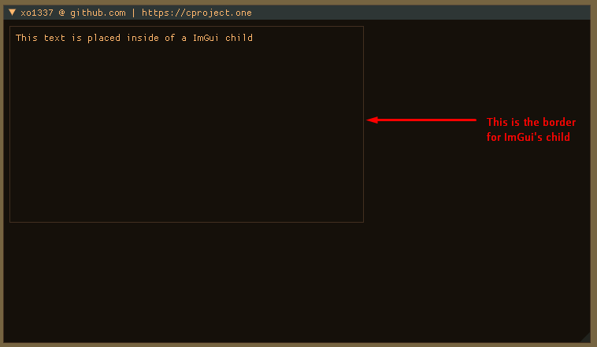

# _ImGui Child_

**Description:**
Draws a rectangle with the specified size given and allows you to customize aspects of it. Such as enabling/disabling borders, changing colors and more
***


|Function|Arguments|Notes|
|--------|---------|-----|
|`ImGui::BeginChild`|`const char* id, ImVec2 size, bool border, ImGuiWindowFlags flags`|`ImGui::EndChild()` must be called after `ImGui::BeginChild()` in order to not cause any exceptions/errors|

```cpp
const ImVec2 child_size = ImVec2(450, 250);
const bool child_border = true;

ImGui::BeginChild("##test_child", child_size, child_border);
ImGui::Text("This text is placed inside of a ImGui child");
ImGui::EndChild();
```


