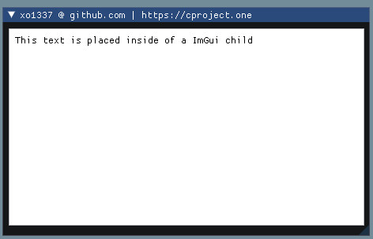

# _ImGui Colors_

**Description:**
Colors in ImGui are more simple than you think. If you can't change the color of an element within the arguments of the function, 
then what you can do is push a color to the imgui stack and then pop it.
***


|Function|Notes|
|--------|-----|
|`ImGui::PushStyleColor(ImGuiCol idx, const ImVec4& color)`|The argument `color` can also be passed in as a `ImColor` structure like this: `ImGui::PushStyleColor(ImGuiCol_ChildBg, ImColor(255, 255, 255).Value);`|
|`ImGui::PopStyleColor(int count)`|The argument `count` should be the amount of colors you're pushing. So if you call `ImGui::PushStyleColor()` 5 times, then you would pass in 5 as the argument.|

```cpp
ImGui::Begin("xo1337 @ github.com | https://cproject.one");

        const ImVec2 child_size = ImVec2(450, 250);
        const bool child_border = true;

        // tell ImGui to set the color white before drawing the child
        ImGui::PushStyleColor(ImGuiCol_ChildBg, ImColor(255, 255, 255).Value);

        // create the child
        ImGui::BeginChild("##test_child", child_size, child_border);

        // change the color of our text. you can use ImGui::TextColored
        // but for this example, we are using ImGui::PushStyleColor
        // this color = black
        ImGui::PushStyleColor(ImGuiCol_Text, ImColor(0, 0, 0, 255).Value);

        // contents inside the child that will be affected
        // we specified ImGuiCol_Text so anything that is text inside of our child
        // will be the color specified
            
        ImGui::Text("This text is placed inside of a ImGui child");

        // finally call ImGui::PopStyleColor() with the number '2' because
        // we are calling ImGui::PushStyleColor 2 times
        ImGui::PopStyleColor(2);

        // finally, end the child and draw it onto our ImGui
        ImGui::EndChild();
        

ImGui::End();
```


