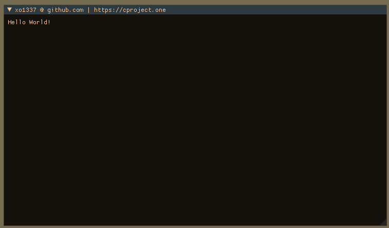
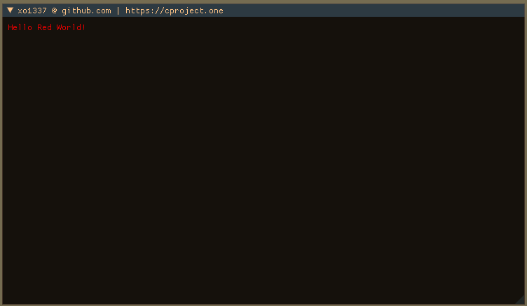

# _ImGui Text_

**Description:**
Draws text within the current ImGui context
***

|Function|Arguments|Example|
|--------|---------|-------|
|`ImGui::Text`|`const char*`|`ImGui::Text("Hello World!");`|

|Function|Arguments|Example|
|--------|---------|-------|
|`ImGui::TextColored`|`ImColor, const char*`|`ImGui::TextColored(ImColor(255,0,0), "Hello Red World!");`|

